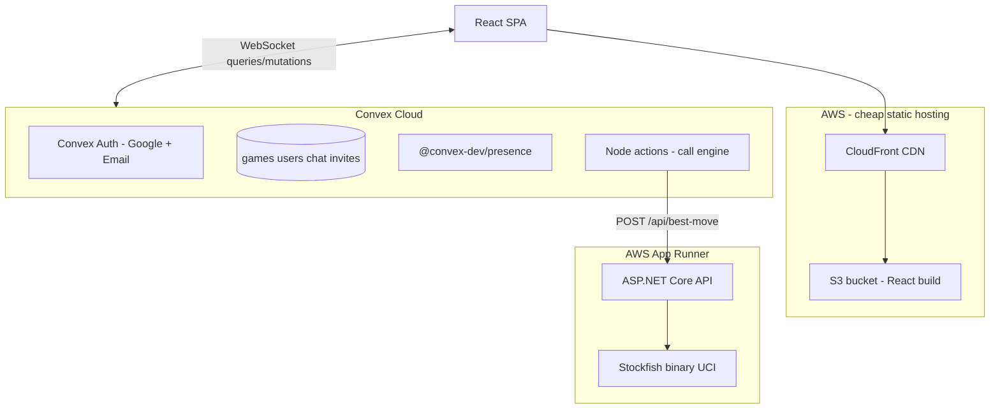

# Chess Lobby

Multiplayer chess with a React frontend, Convex real-time backend, and an ASP.NET Core Stockfish engine service.

## Features

- Sign in with **Google** or **email/password** (Convex Auth)
- User **profiles** (display name, bio, rating)
- **Dashboard** with live online players (`@convex-dev/presence`)
- Challenge online users, **invite links** for anonymous guests, or **play vs computer**
- **In-game chat** scoped to each match
- Server-validated moves via `chess.js` on Convex

## Architecture

React handles the UI; Convex owns real-time state (auth, games, chat, lobby presence); the ASP.NET Core engine service runs Stockfish for computer opponents.



## Monorepo layout

```
chess-lobby/
├── apps/web/           # React + Vite + Tailwind
├── apps/chess-engine/  # ASP.NET Core 8 + Stockfish (UCI)
├── convex/             # Convex backend
└── chess-lobby.sln
```

## Prerequisites

- Node.js 18+
- .NET 8 SDK
- Stockfish (for local engine): `stockfish` on PATH, or use Docker

## Quick start (local)

### 1. Install dependencies

```bash
npm install
```

### 2. Convex backend

```bash
npx convex dev
```

This creates `.env.local` with `CONVEX_URL`. Copy to the web app:

```bash
# apps/web/.env.local
VITE_CONVEX_URL=<same as CONVEX_URL from root .env.local>
```

Configure Convex Auth (in the [Convex dashboard](https://dashboard.convex.dev) or CLI):

```bash
npx convex env set SITE_URL http://localhost:5173
node generateKeys.mjs   # paste JWT_PRIVATE_KEY and JWKS into dashboard
npx convex env set AUTH_GOOGLE_ID <google-oauth-client-id>
npx convex env set AUTH_GOOGLE_SECRET <google-oauth-client-secret>
```

### 3. Chess engine (optional for vs-computer)

```bash
cd apps/chess-engine
dotnet run
```

Set on Convex:

```bash
npx convex env set ENGINE_API_URL http://localhost:5000
npx convex env set ENGINE_API_KEY dev-secret
```

Use the same key in `apps/chess-engine/appsettings.json` as `ENGINE_API_KEY`.

### 4. Web app

```bash
npm run dev:web
```

Open http://localhost:5173

## Production hosting (cheap AWS path)

| Component | Suggested host | Est. cost |
|-----------|----------------|-----------|
| React SPA | **S3 + CloudFront** | ~$0.50–5/mo |
| Convex | **Convex Cloud** | Free tier / usage |
| Stockfish API | **App Runner** (Docker) | ~$5–15/mo |

See [.github/workflows/deploy-aws.yml](.github/workflows/deploy-aws.yml) for a deploy template.

## Scripts

| Command | Description |
|---------|-------------|
| `npm run dev:web` | Vite dev server |
| `npm run convex:dev` | Convex dev deployment |
| `npm run build:web` | Production React build |
| `dotnet run --project apps/chess-engine` | Engine API |

## Environment variables

| Variable | Where | Purpose |
|----------|-------|---------|
| `VITE_CONVEX_URL` | `apps/web` | Convex client URL |
| `AUTH_GOOGLE_ID` / `AUTH_GOOGLE_SECRET` | Convex | Google OAuth |
| `SITE_URL` | Convex | OAuth redirect base |
| `ENGINE_API_URL` / `ENGINE_API_KEY` | Convex | Stockfish service |
| `ENGINE_API_KEY` | chess-engine | API auth |
