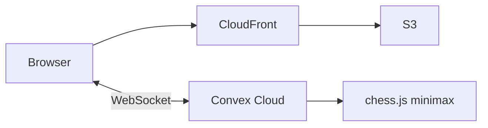

# Minimal-cost demo deploy (S3 + CloudFront + Convex)

Deploy the chess-lobby demo for **~$0–2/month** on AWS (static web only) plus **Convex free tier**. Computer opponents use the **built-in Convex engine** — no Stockfish, App Runner, or Lightsail.

## Architecture



## Prerequisites

- Node.js 18+
- AWS CLI v2
- AWS account (target: **shawnmdevaws2@gmail.com** / profile `shawnmdev`)
- GitHub repo: [shawnmcmahon/chess-lobby](https://github.com/shawnmcmahon/chess-lobby)
- [Convex](https://dashboard.convex.dev) production deployment

---

## 1. Use the correct AWS account (CLI)

The CLI profile name is a **nickname you chose** — not your email or IAM username.

```powershell
aws configure list-profiles
$env:AWS_PROFILE = "shawnmdev"
aws sts get-caller-identity
```

Confirm the **Account** ID matches the account you want (cross-check in the AWS Console when signed in as **shawnmdevaws2@gmail.com**).

Optional — set default profile for new terminals:

```powershell
[System.Environment]::SetEnvironmentVariable("AWS_PROFILE", "shawnmdev", "User")
```

If the profile does not exist yet:

```powershell
aws configure --profile shawnmdev
# Access key + secret from IAM in the target account, region us-east-1
```

---

## 2. One-time AWS infrastructure

From the repo root, with the correct profile:

```powershell
$env:AWS_PROFILE = "shawnmdev"
.\scripts\setup-aws-demo.ps1
```

This deploys [infra/demo-static-site.yaml](../infra/demo-static-site.yaml):

- Private **S3** bucket
- **CloudFront** with SPA routing (403/404 → `index.html`)
- **IAM role** for GitHub Actions (OIDC)

Save the stack outputs:

| Output | GitHub secret |
|--------|----------------|
| `S3BucketName` | `AWS_S3_BUCKET` |
| `CloudFrontDistributionId` | `AWS_CLOUDFRONT_DISTRIBUTION_ID` |
| `GitHubActionsRoleArn` | `AWS_ROLE_ARN` |
| `CloudFrontURL` | Used for Convex `SITE_URL` |

CloudFront may take **5–15 minutes** to finish deploying after the stack completes.

Manual alternative: create the same resources in the console (see plan) or run:

```powershell
aws cloudformation deploy `
  --template-file infra/demo-static-site.yaml `
  --stack-name chess-lobby-demo `
  --parameter-overrides GitHubRepo=shawnmcmahon/chess-lobby `
  --capabilities CAPABILITY_NAMED_IAM `
  --region us-east-1
```

---

## 3. GitHub Actions secrets

**Settings → Secrets and variables → Actions** in `shawnmcmahon/chess-lobby`.

Reference values for this deployment are in [demo-aws-outputs.env.example](demo-aws-outputs.env.example) (safe to commit — no deploy keys).

Configured secrets:

| Secret | Value |
|--------|--------|
| `AWS_ROLE_ARN` | From stack output `GitHubActionsRoleArn` |
| `AWS_S3_BUCKET` | From stack output `S3BucketName` |
| `AWS_CLOUDFRONT_DISTRIBUTION_ID` | From stack output `CloudFrontDistributionId` |
| `VITE_CONVEX_URL` | Production URL, e.g. `https://<your-prod>.convex.cloud` |
| `CONVEX_DEPLOY_KEY` | Convex Dashboard → Production → Settings → Deploy key (**required** for CI `deploy-convex` job) |

Do **not** set `AWS_ECR_REGISTRY` or engine secrets.

**Already configured** (initial setup): `AWS_ROLE_ARN`, `AWS_S3_BUCKET`, `AWS_CLOUDFRONT_DISTRIBUTION_ID`, `VITE_CONVEX_URL`. Add `CONVEX_DEPLOY_KEY` before using the GitHub workflow for Convex deploys.

---

## 4. Convex production

```powershell
# Deploy backend to production (interactive or use deploy key)
npx convex deploy --cmd "npm run build:web" --cmd-url-env-var-name VITE_CONVEX_URL
# Or set CONVEX_DEPLOY_KEY and use CI workflow
```

Ensure **no external Stockfish** on production:

```powershell
npx convex env unset ENGINE_API_URL --prod
npx convex env unset ENGINE_API_KEY --prod
```

After CloudFront is live, set auth site URL (replace with your distribution URL):

```powershell
$env:SITE_URL = "https://d1234abcd.cloudfront.net"
npx convex env set SITE_URL $env:SITE_URL --prod
node scripts/setup-auth.mjs
```

Note: `setup-auth.mjs` uses `npx convex env set` without `--prod` by default. Either:

- Run with production deployment selected in Convex dashboard, or
- Set `SITE_URL`, `JWT_PRIVATE_KEY`, and `JWKS` manually via `npx convex env set ... --prod`

**Google OAuth (optional):**

1. Google Cloud Console → OAuth client → **Authorized JavaScript origins**: `https://<your-distribution>.cloudfront.net`
2. Redirect URI stays on Convex: `https://<your-prod>.convex.site/api/auth/callback/google`
3. `npx convex env set AUTH_GOOGLE_ID ... --prod` and `AUTH_GOOGLE_SECRET`

---

## 5. Deploy

**Actions → Deploy AWS → Run workflow** (manual `workflow_dispatch`).

Jobs:

1. **deploy-web** — build React app, sync to S3, invalidate CloudFront `index.html`
2. **deploy-convex** — `npx convex deploy` to production

---

## 6. Custom domain (thechesslobby.com)

If you register the domain in the **same AWS account** as the CloudFront stack:

```powershell
$env:AWS_PROFILE = "shawnmdev"
.\scripts\connect-custom-domain.ps1 -Domain thechesslobby.com
```

This requests an ACM certificate, validates DNS, updates CloudFront aliases, and creates Route 53 A/AAAA records. Then set Convex auth:

```powershell
$env:SITE_URL = "https://thechesslobby.com"
node scripts/setup-auth.mjs --prod
```

Add `https://thechesslobby.com` and `https://www.thechesslobby.com` to **Google OAuth authorized JavaScript origins** if using Google sign-in.

DNS for a new domain can take minutes to 48 hours to propagate globally.

---

## 7. Demo-day smoke test

- [ ] Open `https://<distribution>.cloudfront.net` — landing loads
- [ ] Sign in (email or Google)
- [ ] **Play vs computer** — opponent moves after yours
- [ ] Visit `/dashboard` or `/game/...` and refresh — SPA routing works
- [ ] Optional: invite link / second browser for multiplayer

---

## Estimated monthly cost

| Service | Cost |
|---------|------|
| S3 + CloudFront | ~$0–2 |
| Convex | $0 (free tier at demo scale) |
| Engine | $0 (built-in) |
| **Total** | **~$0–2/mo** |

For real Stockfish opponents, add **~$7–10/mo** with [deploy-engine-lightsail.md](deploy-engine-lightsail.md).

---

## Troubleshooting

| Issue | Fix |
|-------|-----|
| GitHub deploy fails AssumeRole | OIDC provider exists; `AWS_ROLE_ARN` matches stack; repo name is `shawnmcmahon/chess-lobby` |
| 403 on S3 from browser | Use CloudFront URL, not S3 website URL |
| SPA routes 404 on refresh | CloudFront custom errors 403/404 → `/index.html` with 200 |
| Auth redirect errors | `SITE_URL` must match CloudFront URL exactly (https, no trailing slash) |
| Engine weak / fast | Expected with built-in minimax; set `ENGINE_API_URL` per [deploy-engine-lightsail.md](deploy-engine-lightsail.md) for Stockfish |
