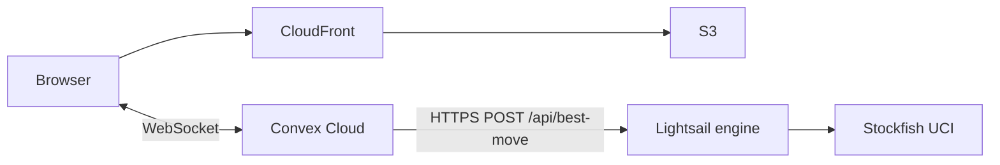

# Optional: Stockfish engine on AWS Lightsail (~$7–10/mo)

By default, **Play vs computer** uses a lightweight built-in minimax engine in Convex (all difficulty levels feel similar). To use real **Stockfish** skill levels (1–20), host `apps/chess-engine` on a small always-on service and point Convex at it.

This is **optional**. The minimal demo in [deploy-demo.md](deploy-demo.md) intentionally skips the engine to stay at **~$0–2/mo**.

## Architecture



Convex calls your engine from `convex/lib/computerEngine.ts` when these production env vars are set:

- `ENGINE_API_URL` — public HTTPS base URL (cloud Convex **cannot** use `localhost`)
- `ENGINE_API_KEY` — shared secret sent as `X-Api-Key` (matches `ENGINE_API_KEY` on the service)

---

## Cost estimate

| Option | RAM | Monthly | Notes |
|--------|-----|---------|--------|
| **Lightsail Linux Micro** | 1 GB | **~$7** | Run Docker yourself; add HTTPS (Caddy) or restrict to HTTP + API key |
| **Lightsail Container Micro** | 1 GB | **~$10** | Easiest — AWS gives a public **HTTPS** URL |
| Lightsail Container Nano | 0.5 GB | ~$7 | Not recommended — .NET + Stockfish often OOM |

Add to your existing stack:

| Service | Cost |
|---------|------|
| S3 + CloudFront + Convex (demo) | ~$0–2 |
| Stockfish engine (Lightsail) | **~$7–10** |
| **Total** | **~$7–12/mo** |

Engine traffic is tiny (one request per computer move), so you stay within Lightsail transfer quotas for personal/demo use.

New AWS accounts may get **3 months free** on Lightsail Container Micro.

---

## Prerequisites

- AWS CLI v2 and a profile with Lightsail access (`aws configure list-profiles`)
- Docker (for building the image)
- Production Convex deployment (`npx convex deploy --prod` already done)
- Region: **us-east-1** (examples below)

Generate a strong API key (store it safely):

```powershell
$engineKey = [Convert]::ToBase64String((1..32 | ForEach-Object { Get-Random -Maximum 256 }))
$engineKey
```

---

## Option A — Lightsail container service (recommended, ~$10/mo)

### 1. Create the service

In the [Lightsail console](https://lightsail.aws.amazon.com/ls/webapp/home/containers) → **Create container service**:

- Power: **Micro** (1 GB RAM)
- Scale: **1** node
- Name: e.g. `chess-lobby-engine`

Or via CLI (after installing the Lightsail plugin):

```powershell
aws lightsail create-container-service `
  --service-name chess-lobby-engine `
  --power micro `
  --scale 1 `
  --region us-east-1
```

Wait until the service state is **READY**.

### 2. Build and push the image

From the repo root:

```powershell
$service = "chess-lobby-engine"
$image = "chess-engine"
$label = "latest"

docker build -f apps/chess-engine/Dockerfile -t "${image}:${label}" .

aws lightsail push-container-image `
  --service-name $service `
  --label $label `
  --image "${image}:${label}" `
  --region us-east-1
```

Note the image name returned (e.g. `:chess-lobby-engine.chess-engine.1`).

### 3. Deploy with environment variables

Create `engine-deployment.json`:

```json
{
  "containers": {
    "chess-engine": {
      "image": ":chess-lobby-engine.chess-engine.1",
      "ports": { "8080": "HTTP" },
      "environment": {
        "ENGINE_API_KEY": "your-generated-secret",
        "STOCKFISH_PATH": "stockfish",
        "ASPNETCORE_URLS": "http://+:8080"
      }
    }
  },
  "publicEndpoint": {
    "containerName": "chess-engine",
    "containerPort": 8080,
    "healthCheck": {
      "path": "/health",
      "intervalSeconds": 10,
      "timeoutSeconds": 5,
      "healthyThreshold": 2,
      "unhealthyThreshold": 3
    }
  }
}
```

Replace the `image` value with the name from step 2 and set `ENGINE_API_KEY`.

```powershell
aws lightsail create-container-service-deployment `
  --service-name chess-lobby-engine `
  --cli-input-json file://engine-deployment.json `
  --region us-east-1
```

When deployment is **ACTIVE**, copy the public URL (e.g. `https://chess-lobby-engine.xxxxx.us-east-1.cs.amazonlightsail.com`).

### 4. Smoke test

```powershell
$base = "https://chess-lobby-engine.xxxxx.us-east-1.cs.amazonlightsail.com"
$key = "your-generated-secret"

Invoke-RestMethod -Method Get -Uri "$base/health"

Invoke-RestMethod -Method Post -Uri "$base/api/best-move" `
  -Headers @{ "X-Api-Key" = $key; "Content-Type" = "application/json" } `
  -Body '{"fen":"rnbqkbnr/pppppppp/8/8/8/8/PPPPPPPP/RNBQKBNR w KQkq - 0 1","skill":10,"movetimeMs":800}'
```

You should get JSON with a `bestMove` UCI string (e.g. `e2e4`).

### 5. Wire Convex production

```powershell
$env:ENGINE_API_URL = "https://chess-lobby-engine.xxxxx.us-east-1.cs.amazonlightsail.com"
$env:ENGINE_API_KEY = "your-generated-secret"
.\scripts\setup-convex-engine.ps1
```

Play a vs-computer game on production and confirm the opponent plays stronger at higher difficulty settings.

---

## Option B — Lightsail Linux instance (~$7/mo)

For lowest cost with a bit more setup:

1. Create a **Linux Micro** instance ($7/mo, 1 GB RAM) in Lightsail.
2. SSH in, install Docker:

   ```bash
   sudo apt-get update && sudo apt-get install -y docker.io
   sudo usermod -aG docker $USER
   # log out and back in
   ```

3. Run the engine (set your API key):

   ```bash
   docker run -d --restart unless-stopped -p 8080:8080 \
     -e ENGINE_API_KEY='your-generated-secret' \
     -e STOCKFISH_PATH=stockfish \
     chess-engine:latest
   ```

   Build on the instance (`git clone` + `docker build`) or pull from a registry.

4. Open port **8080** in the Lightsail instance firewall (Networking tab).

5. **HTTPS:** Convex should call a stable HTTPS URL. Options:
   - Put **Caddy** or nginx on the instance with Let's Encrypt on your domain, or
   - Prefer **Option A** (container service includes HTTPS).

6. Set `ENGINE_API_URL` to your public base URL and run `setup-convex-engine.ps1`.

---

## Convex helper script

```powershell
$env:ENGINE_API_URL = "https://your-engine-url"
$env:ENGINE_API_KEY = "your-generated-secret"
.\scripts\setup-convex-engine.ps1
```

This sets both variables on the **production** deployment. To revert to the built-in engine:

```powershell
npx convex env unset ENGINE_API_URL --prod
npx convex env unset ENGINE_API_KEY --prod
```

---

## Local development

```powershell
docker compose up chess-engine
# http://localhost:8080 — only works with `npx convex dev` on the same machine if you tunnel,
# or set ENGINE_API_URL on your *dev* deployment to a public URL.
```

Cloud Convex **never** reaches `http://localhost:8080`.

---

## Troubleshooting

| Issue | Fix |
|-------|-----|
| Engine still weak | Confirm `ENGINE_API_URL` / `ENGINE_API_KEY` on **prod** (`npx convex env list --prod`) |
| 401 from engine | `X-Api-Key` must match `ENGINE_API_KEY` on the container |
| 503 / OOM | Upgrade to Micro (1 GB); Nano is too small for Stockfish + .NET |
| Convex timeout | Engine uses ~800ms movetime; ensure health check passes and service is ACTIVE |
| `engine_error` in game UI | Check Lightsail logs; verify `/health` and `/api/best-move` manually |

---

## Related docs

- [deploy-demo.md](deploy-demo.md) — static site + Convex without Stockfish
- [README.md](../README.md) — local engine setup
