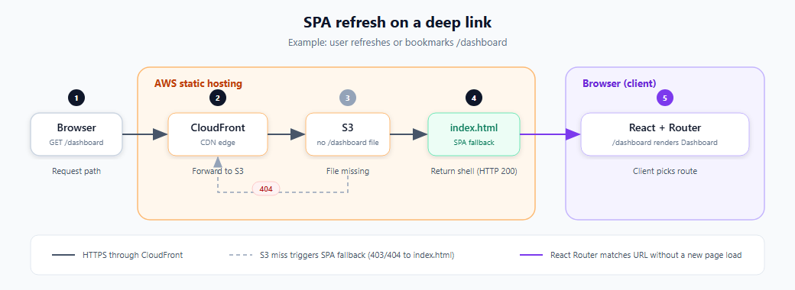

# SPA routing model

Chess Lobby’s web app is a **single-page application (SPA)**. The server always serves the same HTML shell (`index.html`); React and React Router decide which screen to show based on the URL path.

## Traditional sites vs this app

| | Multi-page site | Chess Lobby (SPA) |
|---|-----------------|-------------------|
| **Per URL** | Server returns a different `.html` file | Server returns `index.html` (then JS runs) |
| **“Pages”** | Separate documents | React components swapped in `#root` |
| **In-app navigation** | Full page reload | History API + React re-render (no reload) |

## Bootstrap

1. Browser loads `apps/web/index.html` (one mount point: `<div id="root">`).
2. Vite bundles `src/main.tsx`, which calls `createRoot(...).render(<App />)`.
3. `App.tsx` wraps the tree in `BrowserRouter` and defines routes.

From that point on, navigation is **client-side**: the document does not reload; only the React tree updates.

## Routing model

Routing is declared in `apps/web/src/App.tsx` with **React Router v7** (`react-router-dom`).

### `BrowserRouter`

Uses the browser **History API** (`pushState` / `popstate`). The address bar path (e.g. `/dashboard`, `/game/abc123`) is the source of truth for which route matches.

### Route table

All app routes sit under a parent `<Layout />` route. The layout renders shared chrome (header, theme shell) and an `<Outlet />` where the matched child route renders.

| Path | Component | Auth |
|------|-----------|------|
| `/` (index) | `Landing` | Public |
| `/login` | `Login` | Public |
| `/game/join/:inviteToken` | `JoinGame` | Public |
| `/game/:gameId` | `Game` | Public (guests supported) |
| `/game/:gameId/review` | `GameReview` | `AuthGuard` |
| `/profile/setup` | `ProfileSetup` | `AuthGuard` |
| `/profile` | `Profile` | `AuthGuard` |
| `/dashboard` | `Dashboard` | `AuthGuard` |
| `/leaderboard` | `Leaderboard` | `AuthGuard` |
| `/player/:userId` | `PublicProfile` | Public |
| `*` (anything else) | Redirect to `/` | — |

### Nested layout

```
BrowserRouter
└── Routes
    └── Route (Layout)          ← header, PresenceProvider, <Outlet />
        ├── Route index         → Landing
        ├── Route login         → Login
        ├── Route game/...      → Game, JoinGame, GameReview
        └── ...
```

`Layout` (and theme-specific layouts like `DefaultLayout`) render `<Outlet />` in the main content area so the shell stays mounted while the inner page changes.

### Route params and query strings

Dynamic segments use `:param` in the path. Hooks read them in page logic or controllers:

- `useParams()` — e.g. `gameId` from `/game/:gameId`, `inviteToken` from `/game/join/:inviteToken`, `userId` from `/player/:userId`
- `useSearchParams()` — e.g. `?spectate=1` on a game URL

Example: `useGameController` loads the Convex game with `gameId` from `useParams()`.

### Guards and redirects

- **`AuthGuard`** — wraps protected routes; redirects to `/login` if unauthenticated, or `/profile/setup` if the profile is incomplete.
- **`<Navigate to="..." replace />`** — declarative redirect (e.g. `Landing` sends signed-in users to `/dashboard`; unknown paths go to `/`).

These are ordinary React components in the route tree, not separate server rules.

## Two kinds of navigation

| Kind | Trigger | What happens |
|------|---------|----------------|
| **Client-side** | `<Link>`, `useNavigate()`, `<Navigate>` | URL updates via History API; React Router matches a new route; **no** new HTML document |
| **Full load** | Refresh, bookmark, typed URL, external link | Browser requests that path from the **server**; must get `index.html` back, then JS mounts and Router reads the path |

In-app clicks should feel instant because you never leave the single `index.html` document.

## Why refresh on `/dashboard` still works

There is no `dashboard.html` on S3—only `index.html` and static assets (JS, CSS, images). A direct request to `/dashboard` would 404 unless the CDN is configured to serve the SPA shell for missing paths.

Production CloudFront (`infra/demo-static-site.yaml`) maps 403/404 to `index.html` with HTTP 200:

```yaml
CustomErrorResponses:
  - ErrorCode: 404
    ResponseCode: 200
    ResponsePagePath: /index.html
```

### Refresh flow (sequence)



Source SVG: [spa-refresh-flow.svg](spa-refresh-flow.svg)

Locally, the **Vite dev server** applies the same idea: unknown paths fall back to `index.html` so deep links work during development.

## Mental model (three layers)

1. **Server / CDN** — For app URLs, return the SPA shell (`index.html`), not a per-route HTML file.
2. **React Router** — Read `window.location` and select a matching route.
3. **Page components** — `Landing`, `Dashboard`, `Game`, etc. are normal React components rendered into `#root` (often inside `<Outlet />`).

There are no separate HTML pages—one shell and a **route table** mapping paths to components.

## Related files

| File | Role |
|------|------|
| `apps/web/index.html` | HTML shell and script entry |
| `apps/web/src/main.tsx` | React mount |
| `apps/web/src/App.tsx` | Route definitions |
| `apps/web/src/components/Layout.tsx` | Theme-aware layout + `<Outlet />` |
| `apps/web/src/components/AuthGuard.tsx` | Auth / profile redirects |
| `infra/demo-static-site.yaml` | CloudFront SPA fallback |

## Troubleshooting

| Symptom | Likely cause |
|---------|----------------|
| Refresh on `/game/xyz` → 404 or blank | Missing SPA fallback on the static host |
| URL changes but UI does not | Router not wrapping the tree, or link is `<a href>` causing full reload to a path with no fallback |
| Wrong screen after navigation | Route order or param pattern (e.g. `game/join/:token` must be registered before `game/:gameId`) |
